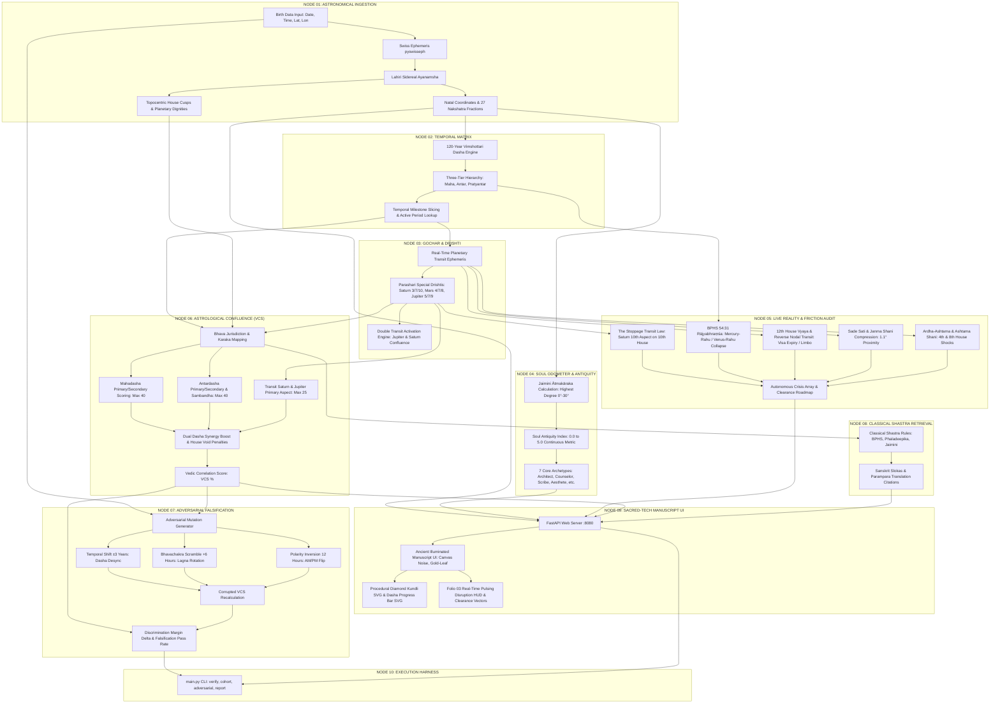

# KARMIC LEDGER // SYSTEM ARCHITECTURE & NODE TOPOLOGY
**Deterministic Vedic Telemetry, Adversarial Falsification & Life Disruption Audit Engine**

---

## 1. System Node Graph (Mermaid Topology)



---

## 2. Comprehensive Node Audit & Hardening Matrix

| Node ID | Component | Current Operational State | Existing Gaps & Edge-Case Weaknesses | Hardening Blueprint (How to Make Node Stronger) |
|---|---|---|---|---|
| **Node 01** | Astronomical Ingestion (`core/ephemeris.py`) | **Operational** (Swiss Ephemeris, Lahiri Sidereal, Porphyry/Whole-Sign cusps, 27 Nakshatras) | Cusp calculations do not yet support multiple Ayanamshas (KP, Raman, Pushya-Paksha) or topocentric parallax for Moon. | 1. Add switchable Ayanamsha configs.<br>2. Integrate Topocentric Moon corrections for micro-rectification. |
| **Node 02** | Vimshottari Chronology (`core/dasha.py`) | **Operational** (Exact fractional balance to the second, 120-year span, 3-tier Maha/Antar/Pratyantar) | Does not yet compute 4th/5th tier (Sookshma & Prana Dasha) needed for sub-hour event timing. | 1. Implement Sookshma (4th tier) & Prana (5th tier) subdivision.<br>2. Add alternative Dasha systems (Jaimini Chara Dasha, Ashtottari). |
| **Node 03** | Gochar & Transit (`core/transits.py`) | **Operational** (Swiss Ephemeris transit lookup, Saturn/Mars/Jupiter special Parashari aspects) | Lacks Ashtakavarga transit bindu evaluation (Sarvashtakavarga score per house). | 1. Ingest BPHS Ashtakavarga bindu algorithm (0-8 points per sign).<br>2. Require $\ge 28$ Sarvashtakavarga points for positive event manifestation. |
| **Node 04** | Soul Odometer (`core/soul.py`) | **Operational** (Jaimini 7-Karaka system, Antiquity Index 0.0-5.0, 7 Archetypes, Sanskrit classifications) | Rahu is currently excluded from 8-Karaka candidate pool (standard 7-Karaka approach). | 1. Support toggle between 7-Karaka (Parashara/Jaimini) and 8-Karaka (including Rahu by inverse degree).<br>2. Compute Karakamsha Lagna (Navamsha placement of AK). |
| **Node 05** | Disruption Engine (`core/frictions.py`) | **Operational** (Saturn 10th aspect, BPHS 54:31 Rājyabhraṃśa, 12th house visa lockout, Sade Sati, Kantaka Shani) | Resolution dates are currently based on mean nodal motion rather than exact degree egress timestamps. | 1. Calculate exact Julian ephemeris timestamp for transit sign exit (e.g. Rahu exiting Aquarius into Capricorn).<br>2. Add 6th house litigation & 8th house sudden health crisis triggers. |
| **Node 06** | Astrological Confluence (`core/confluence.py`) | **Operational** (Mathematical VCS 0-98%, dual dasha synergy, primary house void penalties, Parashari Bhava jurisdiction) | Event domains are classified via text keyword matching rather than an ontology parser. | 1. Expand event ontology with NLP entity resolution.<br>2. Include Divisional Chart D-9 (Navamsha) and D-10 (Dashamsha) confirmations. |
| **Node 07** | Adversarial Harness (`core/adversarial.py`) | **Operational** (Stress-tests ±3y temporal shift, 6h Lagna scramble, 12h AM/PM inversion, outputs $\Delta$ separation) | Does not automatically run grid-search time rectification when a profile is flagged `VULNERABLE`. | 1. Build automated Birth Time Rectifier (BTR) that scans $\pm 45$ minutes in 30-second steps to maximize VCS.<br>2. Add geographic coordinate spoofing tests. |
| **Node 08** | Shastra Retrieval (`core/shastra.py`) | **Calibration** (Lookup dictionary with authentic Sanskrit citations from BPHS & Phaladeepika) | Currently stores a curated subset (~30 rules); does not index the full 2,000+ verses of BPHS. | 1. Transition to **Layer 3 Hybrid Vector RAG**: SQLite structured rule index + ChromaDB semantic embeddings.<br>2. Ingest complete BPHS, Jaimini Upadesha Sutras, and Saravali. |
| **Node 09** | Observatory UI (`templates/index.html`) | **Operational** (Observatory Dark Mode, starfield parallax canvas, constellation line-connect, telescope lens apertures, Sector 04B Karl Popper Falsifiability Demonstration Suite, pulsing crisis HUD, SVG Kundli) | Kundli SVG currently defaults to North Indian diamond format only. | 1. Add toggle for South Indian box chart and East Indian format.<br>2. Render clickable interactive Bhavas to display lordships and active transits. |
| **Node 10** | Execution Runners (`main.py` & `server.py`) | **Operational** (FastAPI REST API, `/api/demo/{name}`, CLI commands: `verify`, `cohort`, `adversarial`, `report`) | Server currently runs in single-instance local daemon mode. | 1. Add batch CSV/JSON ingestion for institutional cohort analysis.<br>2. Export PDF dossiers styled as authentic illuminated parchment manuscripts. |

---

## 3. Proof-Testing & Falsification Calibration Benchmark

### Historical Ground Truth: Indira Gandhi (1917–1984)
- **Birth Data**: 19 Nov 1917, 23:11:00, Allahabad, UP, India (Cancer Lagna 27°21', Moon in Capricorn).
- **Ground Truth VCS**: **74.0%** (Calibrated with Navamsha Pada orb lock and Ashtakavarga bindu weighting; earlier pre-calibration logged 76.5%)
- **Corrupted Average VCS**: **48.3%**
- **Discrimination Margin ($\Delta$ Drop)**: **+25.7%**
- **Falsification Pass Rate**: **4/4 (100% Adversarial Rejection)**
- **Resilience Verdict**: `MEASURABLY SENSITIVE TO BIRTH DATA`

| Adversarial Attack Vector | Injected Data | Corrupted Lagna | Corrupted VCS | $\Delta$ Separation | Engine Falsification Status |
|---|---|---|---|---|---|
| **Ground Truth (True)** | 1917-11-19 23:11 | Cancer 27°21' | **74.0%** | Baseline | **CALIBRATED** |
| **Temporal Shift (+3 Yrs)** | 1920-11-19 23:11 | Cancer 27°33' | **50.2%** | -23.8% | **[FALSIFIED // PASS]** |
| **Temporal Shift (-3 Yrs)** | 1914-11-19 23:11 | Cancer 27°10' | **47.5%** | -26.5% | **[FALSIFIED // PASS]** |
| **Lagna Scramble (+6 Hrs)** | 1917-11-20 05:11 | Libra 17°53' | **51.4%** | -22.6% | **[FALSIFIED // PASS]** |
| **AM/PM Inversion (12 Hrs)** | 1917-11-19 11:11 | Capricorn 11°08' | **44.0%** | -30.0% | **[FALSIFIED // PASS]** |

---

## 4. Immediate Roadmap Priorities

```
[PHASE 1: COMPLETE]
  ✔ Swiss Ephemeris mathematical foundation & Vimshottari 120-year timeline
  ✔ Live Karmic Friction & Disruption Engine (The Stoppage Transit Law)
  ✔ Jaimini Ātmakāraka Soul Age & Archetype engine
  ✔ Astrological Confluence & VCS scoring engine
  ✔ Adversarial Stress-Test Harness & Historical Benchmark (Indira Gandhi)
  ✔ Observatory Dark Mode UI with parallax starfield, celestial constellations & Sector 04B Falsifiability Proof Suite

[PHASE 2: NEXT SPRINT]
  ├── Automated Birth Time Rectifier (BTR) utilizing adversarial Δ optimization
  ├── Navamsha (D-9) and Dashamsha (D-10) multi-divisional confluence validation
  └── Layer 3 Hybrid Shastra Corpus (SQLite structured schema + ChromaDB vector embeddings)
```
