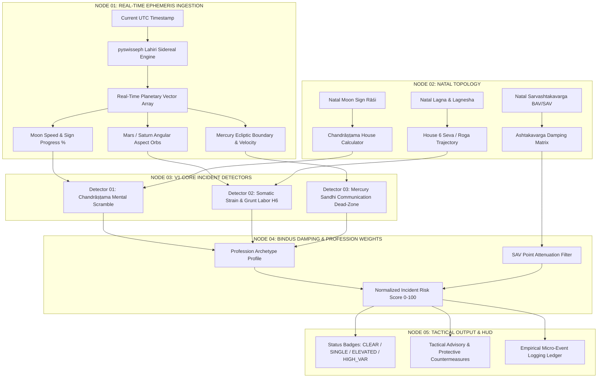

# THE 24-HOUR DAILY INCIDENT RADAR // MICRO-TRANSIT ENGINE SPECIFICATION
**Autonomous Short-Horizon Turbulence Detection, Astrodynamic Vector Modeling & Multi-Profession Taxonomy**

---

## 1. Executive Concept: Micro-Clockwork vs. Macro-Clockwork

In classical Vedic chronometry, human life is governed by multi-tiered clockwork operating across vastly different timescales:

```
┌────────────────────────────────────────────────────────────────────────┐
│ MACRO-CLOCKWORK (Seasons of Decades)                                  │
│ 120-Year Vimshottari Dasha Engine (Mahadasha / Antardasha)             │
│ Dictates macro-themes: career ascent, health baseline, relocation.     │
└──────────────────────────────────┬─────────────────────────────────────┘
                                   │ Filtered Through
                                   ▼
┌────────────────────────────────────────────────────────────────────────┐
│ MESO-CLOCKWORK (Seasons of Years)                                      │
│ Slow Planetary Transits (Saturn ~2.5y, Jupiter ~1.0y, Rahu/Ketu ~1.5y) │
│ Establishes environmental friction, Sade Sati, structural stoppages.   │
└──────────────────────────────────┬─────────────────────────────────────┘
                                   │ Activated By
                                   ▼
┌────────────────────────────────────────────────────────────────────────┐
│ MICRO-CLOCKWORK (The 24–48 Hour Incident Radar)                        │
│ Fast Planetary Transits: Moon (~13.2°/day), Mercury, Mars, Sun         │
│ Identifies the exact day "turbulence spikes" occur inside a good era.  │
└────────────────────────────────────────────────────────────────────────┘
```

### The Problem Statement: "Why Good Eras Have Bad Tuesdays"
A user may run a triumphant Jupiter-Venus Mahadasha (macro-promising career elevation, capital inflow, and prestige), yet experience a catastrophic Tuesday where:
- A critical production cluster drops unexpectedly,
- An executive email goes unanswered for 48 hours,
- A sudden back or knee spasm incapacitates them for 36 hours.

Macro-dashas set the baseline probability distribution; **fast-moving transits (Gochar) and cuspal border-crossings (Sandhi/Gandanta) pull the localized trigger**. The **24-Hour Daily Incident Radar** is an operational telemetry engine designed to detect short-horizon turbulence spikes, calculate sector-specific vulnerability vectors, and deliver actionable tactical countermeasures before friction manifests.

---

## 2. System Architecture & Telemetry Pipeline



---

## 3. Core V1 Incident Detectors (Implemented in `core/daily.py`)

### Detector 01: Mental Scramble Detector (`Chandrāṣṭama`)
* **Astronomical Engine:** Computes the sign difference between real-time transit Moon and the natal Moon sign ($Rāśi$).
* **Mathematical Condition:**
  $$\text{House}_{\text{Moon}} = \left((\text{SignIndex}_{\text{TransitMoon}} - \text{SignIndex}_{\text{NatalMoon}}) \pmod{12}\right) + 1 = 8$$
* **Orb & Velocity:** The Moon travels $\approx 13.18^\circ / \text{day}$, traversing one 30° zodiacal sign every $\approx 54.5 \text{ hours}$.
* **Classical Precedent:** *Phaladeepika* (Ch. 26, Sl. 22) and *Brihat Parashara Hora Shastra* state that when the Moon occupies the 8th house from natal Moon, the mind (*Manas*) loses its stabilizing substrate, entering *Vaikalya* (agitation, fatigue, disorientation).
* **Observed Real-World Manifestations:**
  - Unforced cognitive errors, brain fog, and syntax bugs.
  - Sudden, unexpected cancellations of high-stakes interviews or scheduled calls.
  - High subjective irritation, reactive communication, emotional volatility.
* **Tactical Protocol:**
  - Postpone first-impression pitch meetings, contract signings, or volatile negotiations.
  - Convert active work to low-stakes asynchronous administration, testing, or passive reading.

---

### Detector 02: Somatic Strain & Grunt Labor Detector (`House 6 Vector`)
* **Astronomical Engine:** Identifies the user's *Lagnesha* (ruling planet of the 1st House Ascendant) and monitors its transit through House 6 (*Roga, Kshata, Seva Bhāva*), combined with Mars and Saturn aspectual telemetry.
* **Mathematical Conditions:**
  $$\text{House}_{\text{Lagnesha}} = \left((\text{SignIndex}_{\text{Lagnesha}} - \text{SignIndex}_{\text{Lagna}}) \pmod{12}\right) + 1 = 6$$
  - **Mars Conjunction/Aspect:** Conjunction within $5.0^\circ$ orb, or Parashari 4th, 7th, 8th special aspect $\implies$ Acute physical stress, cuts, falls, inflammation.
  - **Saturn Aspect:** Parashari 3rd, 7th, 10th special aspect on Lagnesha $\implies$ Chronic load, bone/joint pressure, lumbar and knee vulnerability.
  - **Mars Debilitation:** Mars in Cancer ($93^\circ - 120^\circ$) or water signs $\implies$ Slip-and-fall hazards, dishwashing/scalding incidents, liquid accidents.
* **Observed Real-World Manifestations:**
  - Physical joint vulnerability (specifically knees, ankles, lumbar spine).
  - Unscheduled, unglamorous physical toil or manual chores (*Seva*) that drain stamina.
  - Subordinate clashes or bureaucratic micro-friction.
* **Tactical Protocol:**
  - Strictly avoid rushed physical movements, running on wet stairs, or untested heavy lifting.
  - Expect that manual, unglamorous chores will demand attention—treat them as non-negotiable somatic grounding rather than disruptions.

---

### Detector 03: Email & Communication Dead-Zone (`Mercury Sandhi / Gandanta`)
* **Astronomical Engine:** Tracks transit Mercury's ecliptic longitude relative to sign boundaries (*Rāśi Sandhi*).
* **Mathematical Condition:**
  $$\text{DegreeInSign}_{\text{Mercury}} \ge 28.75^\circ \quad \text{OR} \quad \text{DegreeInSign}_{\text{Mercury}} \le 1.25^\circ$$
* **Special Case (Gandanta):** When the boundary is between a Water sign and a Fire sign (Cancer $\rightarrow$ Leo, Scorpio $\rightarrow$ Sagittarius, Pisces $\rightarrow$ Aries), the Sandhi is classified as *Tīvra Gandanta* (acute junctional vortex where intellectual stability collapses).
* **Observed Real-World Manifestations:**
  - Recruiter and hiring manager emails stall indefinitely without response.
  - Critical outreach messages delivered to spam folders or overlooked.
  - API contracts, webhook payloads, or serialization code containing subtle delimiter/encoding faults.
  - Automated scheduling tools double-booking or desynchronizing time zones.
* **Tactical Protocol:**
  - Zero high-stakes cold outreach; pause outbound pipeline for 24–48 hours until Mercury advances past $01^\circ 15'$.
  - Manually double-check email recipient fields, attachments, and contract clauses.

---

## 4. The Multi-Profession Dilemma: Why Generic Radars Break

A single monolithic "Daily Incident Score" fails because **risk is contextual to professional exposure**:

| Dimension | Software Architect / Quant | Construction / Trades / Field Tech | Executive / Founder / BD |
| :--- | :--- | :--- | :--- |
| **Catastrophic Failure** | Corrupt database migration, silent memory leak | Slipped disk, dropped girder, machinery cut | Failed fundraising term-sheet, boardroom mutiny |
| **Dominant Karaka** | Mercury (Logic), Ketu (Abstraction), Rahu (Systems) | Mars (Mechanical Force), Saturn (Labor/Endurance) | Sun (Authority), Jupiter (Capital), Mercury (Deals) |
| **Sensitive Houses** | 5th (Intellect), 8th (Bugs/Hidden Flaws), 3rd (Code) | 6th (Physical Strain), 3rd (Hands), 10th (Action) | 10th (Status), 11th (Liquidity), 7th (Partnerships) |
| **Sandhi Impact** | Git rebase conflicts, dropped websocket connections | Delayed delivery of building materials | Silence from lead investors, ambiguous LOIs |

Therefore, the **V2/V3 Incident Radar Engine** must transition from a static 3-detector module to a **Dynamic Profile-Weighted Incident Engine**.

---

## 5. Multi-Profession Taxonomy & Specialized Detection Vectors

```
                                  [PROFESSION ARCHETYPES]
                                             │
      ┌──────────────────┬───────────────────┼───────────────────┬──────────────────┐
      ▼                  ▼                   ▼                   ▼                  ▼
[Engineering & Tech] [Executive & BD]    [Trades & Physical] [Creative & Media] [Clinical/Care]
• Mercury-Ketu Flaws • Sun-Saturn Clash  • Mars-Saturn Drop  • Venus Combustion • 6th/12th Shift
• Mars in H8 Outage  • Jupiter Blindspot • Nakshatra Reflex  • Rahu Distortion  • Moon Vitality
```

### Archetype A: Software Engineers, System Architects & Quants
* **Key Significators (*Kārakas*):** Mercury (*Buddhi* / Logic), Ketu (*Moksha* / Machine Code / Zeroes & Ones), Rahu (Network protocols / Complex synthetic architectures).
* **Specialized Vector A1: The "Heisenbug / Silent Data Corruption" Index**
  - *Trigger:* Transit Ketu conjoining transit Mercury, or transit Mercury crossing natal Rahu/Ketu axis.
  - *Symptom:* Subtle edge cases, race conditions in concurrent threads, integer overflow, hidden memory leaks that pass unit tests but fail under load.
  - *Mitigation:* Mandatory secondary human code review; freeze unvetted library updates.
* **Specialized Vector A2: The "Friday Production Deployment Crash" Index**
  - *Trigger:* Transit Mars in 8th house from Lagna or aspecting 10th house while Moon is afflicted.
  - *Symptom:* Rash command-line executions, failed database schema migrations, cloud service outages.
  - *Mitigation:* Hard deployment freeze; strict read-only mode on production clusters.
* **Specialized Vector A3: The "Hallucinated Architecture" Index**
  - *Trigger:* Transit Rahu aspecting transit Mercury in Air signs (Gemini, Libra, Aquarius).
  - *Symptom:* Over-engineering, premature optimization, chasing novel AI framework fads that derail sprint velocity.

---

### Archetype B: Founders, C-Suite Executives & High-Stakes BD
* **Key Significators (*Kārakas*):** Sun (*Ātma* / Executive Authority), Jupiter (*Guru* / Capital / Expansion), Mercury (*Vanijya* / Contracts).
* **Specialized Vector B1: The "Boardroom Friction & Authority Challenge" Index**
  - *Trigger:* Transit Saturn in exact hard aspect (4th, 7th, 10th) to natal Sun or 10th House Lord.
  - *Symptom:* Investors pushing back on strategic roadmaps, micro-management inquiries from board members, sudden regulatory inquiries.
  - *Mitigation:* Present defensive numbers-first dossiers; avoid autocratic mandates; maintain calm stoicism.
* **Specialized Vector B2: The "Capital Blindspot / Overextension" Index**
  - *Trigger:* Transit Jupiter combust (*Asta*) within $11^\circ$ of the Sun, or transiting 12th house.
  - *Symptom:* Over-optimistic financial projections, miscalculating runway, agreeing to punishing liquidation preferences.
  - *Mitigation:* Implement rigorous dual-signature spending limits; delay major funding rounds until Jupiter clears combustion.
* **Specialized Vector B3: The "Deal Freeze & Buyer Remorse" Index**
  - *Trigger:* Transit Venus or Mercury in *Rāśi Sandhi* while transiting 11th House of Gains.
  - *Symptom:* Verbal agreements stall before signature; enterprise procurement teams request protracted legal revisions.

---

### Archetype C: Field Engineers, Physical Trades, Construction & Athletics
* **Key Significators (*Kārakas*):** Mars (*Bhoomi / Yantra* / Force / Sharp Objects), Saturn (*Shramika* / Manual Endurance / Heavy Matter), Sun (*Pitta* / Bone Vitality).
* **Specialized Vector C1: The "Mechanical Impact & Tool Failure" Index**
  - *Trigger:* Mars and Saturn in mutual aspect ($180^\circ$) or conjunction occurring within the 3rd House (Hands/Dexterity) or 6th House (Injuries).
  - *Symptom:* Power tool malfunctions, dropped heavy equipment, sheared bolts, lacerations.
  - *Mitigation:* Enforce strict PPE audits; slow down equipment cycle rates by 25%; inspect lifting cables and hydraulic lines.
* **Specialized Vector C2: The "Neuromuscular Reflex Latency" Index**
  - *Trigger:* Transit Moon passing through *Tikshna* (sharp/dreadful) Nakshatras (*Ardra, Mula, Jyeshtha*) while occupying the 6th or 8th house from natal Lagna.
  - *Symptom:* Delayed motor reaction times, misstepping on ladders, dropping hand tools, sudden tendon tweaks.
  - *Mitigation:* Zero high-wire or unguarded high-risk manual operations; mandatory hydration and neuromuscular warm-up routines.
* **Specialized Vector C3: The "Lumbar & Spondylotic Overload" Index**
  - *Trigger:* Saturn aspecting natal Mars while transit Mars enters an Earth or Water sign.
  - *Symptom:* Lower back spasms, disc compression, joint weariness from prolonged static posture.

---

### Archetype D: Creative Directors, Writers, UX/UI Designers & Artists
* **Key Significators (*Kārakas*):** Venus (*Shukra* / Aesthetics / Proportion), Moon (*Manas* / Imagination), Mercury (Drafting / Layout).
* **Specialized Vector D1: The "Aesthetic Dissociation / Scope Creep" Index**
  - *Trigger:* Transit Venus afflicted by Rahu (illusion/excess) in 5th or 12th house.
  - *Symptom:* Over-polishing trivial visual assets while missing functional UX clarity; chaotic color balances; endless revision cycles.
  - *Mitigation:* Lock design tokens early; restrict iterations to three feedback passes.
* **Specialized Vector D2: The "Creative Anhedonia / Blank Page" Index**
  - *Trigger:* Transit Moon eclipsed or conjoined Ketu in the 5th House of Creative Intellect (*Purva Punya*).
  - *Symptom:* Complete writer's block, artistic self-doubt, total lack of enthusiasm for ongoing projects.
  - *Mitigation:* Stop forcing creative output; switch to technical asset ingestion, cataloging, or historical moodboarding.

---

### Archetype E: Clinical Healthcare Workers, Surgeons & Emergency Personnel
* **Key Significators (*Kārakas*):** Sun (Vitality / Prāṇa), Mars (Surgery / Blood / Incisions), Jupiter (Healing / Diagnosis), Saturn (Chronic Sickness).
* **Specialized Vector E1: The "Diagnostic Hesitation & Shift Fatigue" Index**
  - *Trigger:* Transit Moon in 12th house (*Vyaya* / Exhaustion) with Saturn transit aspecting Lagna.
  - *Symptom:* Severe circadian rhythm desynchronization, compassion fatigue, decision paralysis during triage.
  - *Mitigation:* Enforce strict shift handoff checklists; avoid double shifts during this transit.
* **Specialized Vector E2: The "Surgical Tremor & Precision Deviation" Index**
  - *Trigger:* Mars combust Sun within $3^\circ$ or in sandhi while aspecting the 3rd House of Hands.
  - *Symptom:* Micro-tremors in fine motor skills, elevated intra-operative bleeding risk, unexpected anatomical anomalies.

---

## 6. Mathematical Fusion: Ashtakavarga Damping Matrix

A raw planetary transit does not affect all individuals equally. If transit Moon enters House 8 (Chandrāṣṭama), but that 8th house possesses **36 Sarvashtakavarga (SAV) Bindus**, the disruption is largely neutralized. Conversely, if it possesses only **20 Bindus**, the disruption is severe.

### Damping Formula Specification
Let $R_{\text{raw}} \in [0, 100]$ be the raw incident score computed by a detector.
Let $B_{\text{SAV}}$ be the total SAV bindus in the transited sign (Standard average baseline = 28 bindus).
Let $B_{\text{BAV}}$ be the specific planet's Bhinnashtakavarga bindus in that sign (Standard baseline = 4 bindus).

The **Damped Incident Score** $R_{\text{damped}}$ is calculated as:

$$R_{\text{damped}} = R_{\text{raw}} \times \left(1.0 - \left[\frac{B_{\text{SAV}} - 28}{28} \times \alpha + \frac{B_{\text{BAV}} - 4}{8} \times \beta\right]\right)$$

Where:
* $\alpha = 0.50$ (Macro-environmental buffer weight)
* $\beta = 0.50$ (Planet-specific operational competence weight)
* Clamped strictly such that:
  $$0.15 \times R_{\text{raw}} \le R_{\text{damped}} \le 1.85 \times R_{\text{raw}}$$

* **Interpretation:**
  - If a user has 35 SAV bindus in the 8th house, $R_{\text{damped}} \approx 0.65 \times R_{\text{raw}}$ (Friction is damped by 35%).
  - If a user has 19 SAV bindus in the 8th house, $R_{\text{damped}} \approx 1.35 \times R_{\text{raw}}$ (Friction is amplified by 35%).

---

## 7. The Empirical Micro-Event Logging Ledger (Calibration Loop)

To prevent the engine from degenerating into unfalsifiable folklore, all predicted incident vectors must be subjected to an **Empirical Verification Pipeline**.

### SQLite Schema Definition (`incident_logs.db`)

```sql
CREATE TABLE IF NOT EXISTS daily_incident_telemetry (
    telemetry_id TEXT PRIMARY KEY,
    timestamp_utc TEXT NOT NULL,
    user_id TEXT NOT NULL,
    profession_profile TEXT NOT NULL,       -- 'ENGINEERING', 'EXECUTIVE', 'TRADES', etc.
    overall_status TEXT NOT NULL,           -- 'CLEAR', 'SINGLE', 'ELEVATED', 'HIGH_VAR'
    chandrashtama_active INTEGER NOT NULL,
    somatic_h6_active INTEGER NOT NULL,
    mercury_sandhi_active INTEGER NOT NULL,
    predicted_risk_score REAL NOT NULL,
    top_target_vectors TEXT NOT NULL        -- JSON array: ['KNEES', 'EMAIL_STALL', etc.]
);

CREATE TABLE IF NOT EXISTS empirical_micro_events (
    event_id TEXT PRIMARY KEY,
    telemetry_id TEXT REFERENCES daily_incident_telemetry(telemetry_id),
    logged_at_utc TEXT NOT NULL,
    event_category TEXT NOT NULL,           -- 'COGNITIVE', 'SOMATIC', 'COMMUNICATION', 'SYSTEM'
    perceived_friction_severity INTEGER,    -- 1 (Negligible) to 5 (Catastrophic)
    event_description TEXT NOT NULL,
    falsification_match INTEGER NOT NULL    -- 1 if predicted vector matched reality, 0 if false alarm
);
```

### Continuous Calibration Metric (Falsification Pass Rate)
The engine maintains a rolling 30-day statistical reliability index:

$$\text{Precision} = \frac{\text{True Incident Warnings (Severity} \ge 3\text{)}}{\text{Total Incident Alerts Generated}}$$

If the rolling Precision drops below $65\%$, the orb thresholds (e.g. Mercury Sandhi $1.25^\circ \rightarrow 0.75^\circ$) are automatically tightened via gradient adjustment.

---

## 8. Development Roadmap & Engineering Implementation Milestones

```
[PHASE 1: V1 BASELINE] ───► [PHASE 2: PROFILE SCHEMA] ───► [PHASE 3: ASHTAKAVARGA] ───► [PHASE 4: HUD LEDGER]
• Chandrāṣṭama           • Profession Enum            • SAV/BAV Damping Math        • Real-time Radar Sweep
• H6 Somatic Lord        • Karaka Weight Matrix       • Orb Tightening Logic        • 1-Click Micro-Logger
• Mercury Sandhi Zone    • Vector Classification      • Multi-Planet Parashari      • Weekly Rolling Graph
(STATUS: ACTIVE)         (TARGET: SPRINT 2)           (TARGET: SPRINT 3)            (TARGET: SPRINT 4)
```

### Phase 1: V1 Foundation (Complete)
- [x] Mathematical Chandrāṣṭama 8th-house locator in `core/daily.py`.
- [x] Lagnesha House 6 transit + Mars/Saturn Parashari aspects.
- [x] Mercury Rāśi Sandhi border-crossing detection ($<1.25^\circ$ or $>28.75^\circ$).
- [x] Unified JSON payload generator in `compute_daily_incident_radar()`.

### Phase 2: Multi-Profession Architecture (Next Priority)
- [ ] Define `ProfessionArchetype` enum in `core/daily.py`:
  `SOFTWARE_ARCHITECT`, `EXECUTIVE_FOUNDER`, `TRADES_CONSTRUCTION`, `CREATIVE_MEDIA`, `HEALTHCARE_CLINICAL`.
- [ ] Implement profession-specific vector evaluators (`_detect_software_vectors`, `_detect_trades_vectors`).
- [ ] Expose dynamic profession selector in the FastAPI `/api/daily-radar` endpoint.

### Phase 3: Ashtakavarga Damping & Precision Tuning
- [ ] Wire `core/ashtakavarga.py` bindu counts directly into the incident scoring pipeline.
- [ ] Calculate `R_damped` using house-specific SAV and planet-specific BAV.
- [ ] Add Gandanta detection (Cancer/Leo, Scorpio/Sagittarius, Pisces/Aries transitions).

### Phase 4: HUD Integration & One-Click Micro-Logger
- [ ] Render the "24-Hour Daily Turbulence Sweep" directly on the web HUD (`templates/index.html`).
- [ ] Provide a quick interactive logging drawer: *"Log Today's Micro-Incident"* (takes 5 seconds: choose tag [Bug / Meeting Stall / Knee Spasm / Clear Day] + Severity 1-5).
- [ ] Graph 7-day predicted friction curve vs. empirical logged friction.
